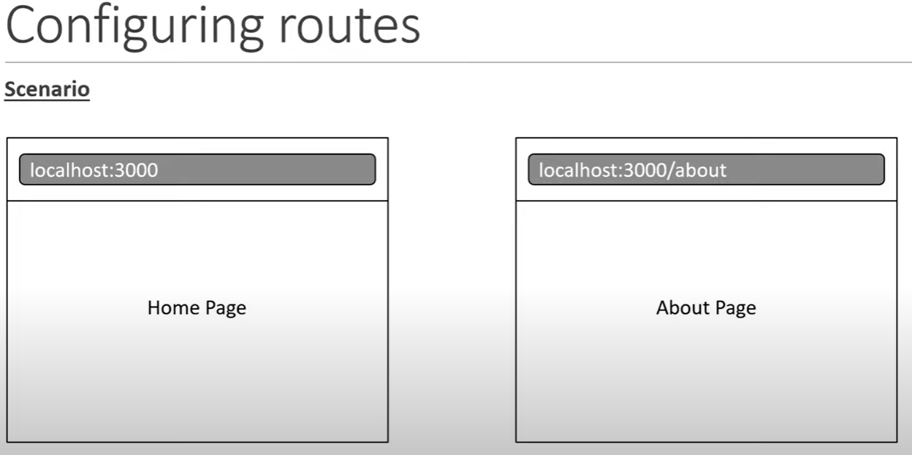
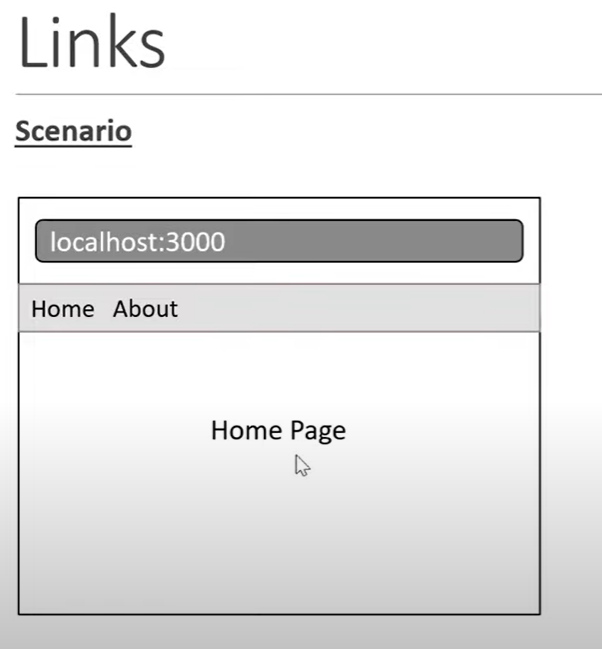
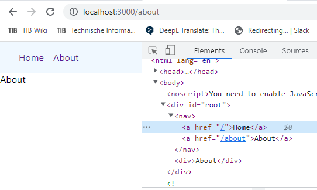
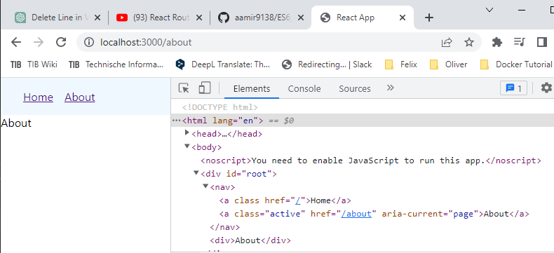
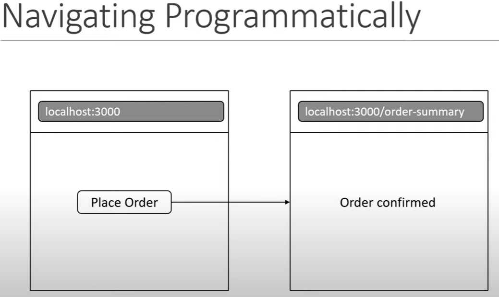
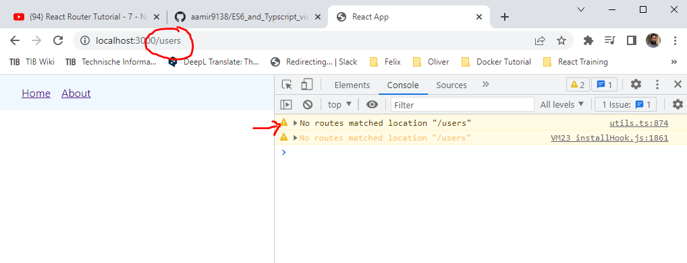

# react_router_vishwas_course (react-router version 6 !!!)

## lecture 1 Introduction

### what is React Router?

- it is a fully-featured client and server-side routing library for React
- it helps create and navigate between different URLs that make up your web application
- it provides unique URLs for different components in the app and makes UI easily shareable with other users

## lecture 2 Installation and setup

1. run this in terminal `npx create-react-app react-router-demo`
2. install react-router-dom version 6

```
npm install react-router-dom@6
```

## lecture 3 Configuring routes

1. take a scenario for configuring routesas mentioned in the image below. at `/` Home page and at `/about` About page
   

2. To implement this scenario with a `router`. follow the below steps

### Step 1 import BrowserRouter from react-router-dom

- in index.js file import it as below

```
import { BrowserRouter } from 'react-router-dom'
```

### Step 2

- in `index.js` wrap the `<App/>` component in `<BrowserRouter></BrowserRouter>`

```
import React from 'react';
import ReactDOM from 'react-dom/client';
import { BrowserRouter } from 'react-router-dom';
import './index.css';
import App from './App';
import reportWebVitals from './reportWebVitals';

const root = ReactDOM.createRoot(document.getElementById('root'));
root.render(
  <React.StrictMode>
    <BrowserRouter>
      <App />         // here I mean
    </BrowserRouter>
  </React.StrictMode>
);

// If you want to start measuring performance in your app, pass a function
// to log results (for example: reportWebVitals(console.log))
// or send to an analytics endpoint. Learn more: https://bit.ly/CRA-vitals
reportWebVitals();
```

### Configure the routes in App.js

1. create `components` folder in `src`.
2. create 2 components inside it named as `Home.js` and `About.js`.
3. for the routes configuration we need 2 components `Routes` and `Route` in `App.js` from `react-router-dom`

```
import { Routes, Route} from 'react-router-dom'
```

4. use `Routes` and `Route` component as below and pass the props of `path` and `element`
5. `path` will take the value of `/` and `/about` depending on the which component we want to show
6. `element` will the the component name like `Home` or `About`

```
function App() {
  return (
    <Routes>
      <Route path="/" element={<Home />}></Route>
      <Route path="/about" element={<About />}></Route>
    </Routes>
  );
}

export default App;
```

7. we can make `Route` a self closing tag like below

```
    <Routes>
      <Route path="/" element={<Home />}/>
      <Route path="/about" element={<About />}/>
    </Routes>
```

8. important keywords in todays lecture:

- package: `react-router-dom`
- components: `BrowserRouter`, `Routes`, `Route`
- props: `path`, `element`

## lecture 4 Links

- using an element in the UI to navigate to different route.
- previously we were changing URL in the browser to go to different routes
- so we need to make it interactive. for that add a Navbar with 2 links `Home` and `About`



1. create a component `Navbar.js` in `components` folder.
2. import `Link` from `react-router-dom`.
3. write a `nav` tag. inside `nav` use `Link` components.
4. `Link` work as an anchor tag where instead of `href` we give path in `to` prop as below.

```
/* lecture 4 Links */
import { Link } from 'react-router-dom';

export const Navbar = () => {
  return (
    <nav>
      <Link to="/">Home</Link>
      <Link to="/about">About</Link>
    </nav>
  );
};
```

5. in `App.js` we can import the `Navbar` component as below

```
/* lecture 4 Links */
import { Routes, Route } from 'react-router-dom';
import { About } from './components/About';
import { Home } from './components/Home';
import { Navbar } from './components/Navbar';
function App() {
  return (
    <>
      <Navbar />
      <Routes>
        <Route path="/" element={<Home />} />
        <Route path="/about" element={<About />} />
      </Routes>
    </>
  );
}

export default App;
```

6. if we inspect the individual link in browser. we can see that these `Links` are actually `anchor tags`. and the `to` prop is and `href` attribute



7. if we are navigating inside an application we must use `Link` with the Router but if we want to navigate outside of the application we can use anchor tag i.e `<a>` tag

## lecture 5 Active Links

- To style the active link differently we need to make changes both with `Link` component and the `css`.

### NavLink

- so instead of simple `Link` we have a `NavLink` which knows either the link is active or not
- what is so special about this `NavLink` is that by default it receive an `active` class when it is clicked.
- so we can change our `Navbar` component as below.

```
/* lecture 5 Active Links */
import { NavLink } from 'react-router-dom';

export const Navbar = () => {
  return (
    <nav>
      <NavLink to="/">Home</NavLink>
      <NavLink to="/about">About</NavLink>
    </nav>
  );
};
```

- we can inspect this in the browser to see the active class in the picture below.
  

- with this active class we can add some styles in our CSS.

```
nav a.active {
  text-decoration: none;
  font-weight: bold;
}
```

- instead of CSS we may use js solution for styling the active link. in that solution the `NavLink` component provides `isActive` boolean value which will be applied the `style` prop depending if the link is active or not. the code will be something like this.

```
// for the js styling solution
import { NavLink } from 'react-router-dom';

export const Navbar = () => {
  const navLinkStyles = ({ isActive }) => {
    return {
      fontWeight: isActive ? 'bold' : 'normal',
      textDecoration: isActive ? 'none' : 'underline',
    };
  };
  return (
    <nav>
      <NavLink style={navLinkStyles} to="/">
        Home
      </NavLink>
      <NavLink style={navLinkStyles} to="/about">
        About
      </NavLink>
    </nav>
  );
};
```

### Link or NavLink

- use `NavLink` for navbar items, breadcrums or areas where we need to change UI based on `active` class.
- for other routes in the application just use the `Link` component

## Navigating Programmatically

- in the picture below a scenario is presented. where if let say an order is placed the browser programmatically navigate you to the `order confirmation` page.



- for us we will simulate this with the onClick of the button navigate to the confirmation page.

1. create a component `OrderSummary.js`
2. in `Home` component create a button `place order`. on click of that button call the `navigate` function with the parameter of the `OrderSummary` component path.
3. the `navigate` function can be received from the `useNavigate()` hook from `react-router-dom`

```
/* lecture 6 Navigating Programmatically */
import { useNavigate } from 'react-router-dom';
export const Home = () => {
  const navigate = useNavigate();
  return (
    <>
      <div>Home</div>
      <button onClick={() => navigate('/order-summary')}>place order</button>
    </>
  );
};
```

4. if we want to go back from the order-summary page we can use the same technique the only difference is that for the `go back` functionality use a number of `-1` as a parameter to the `navigate(-1)` function

```
/* lecture 6 navigating Programmatically */
import { useNavigate } from 'react-router-dom';
export const OrderSummary = () => {
  const navigate = useNavigate();
  return (
    <>
      <div>Order Confirmed</div>
      <button onClick={() => navigate(-1)}>go back</button>
    </>
  );
};
```

5. now you might want to replace the `history` instead of pushing a routes on to the stack. for that you can pass in an optional second `argument`.

6. so in `Home.js` to navigate function we pass in an optional second argument which is an `object` with a property `replace` set to true as below

```
// replacing history instead of pushing route to the stack
import { useNavigate } from 'react-router-dom';
export const Home = () => {
  const navigate = useNavigate();
  return (
    <>
      <div>Home</div>
      <button onClick={() => navigate('/order-summary', { replace: true })}>
        place order
      </button>
    </>
  );
};
```

7. so if we `place order` and then press `go back` you will see that we come all the way back to the `google page`. This is because we replace the history.

## lecture 7 No Match Route

- let us take a look at configuring a `No Match Route` in a react application.
- currently if we go to a route which is not configured. for example `localhost:3000/user`. we don't see a UI below the Navbar.
- And if we take a look at the console we have a warning. `No routes matched location "/user"`. The scenario is displayed in the picture.
  
- This scenario is not favourable for a user point of view. A user might thing the app is still loading or there is an error in `/user` route.
- The better way would be to inform the user that the URL doesn't match any route in our application.
- To tackle this create a component which will be invoked if the URL given didn't match any of the other given routes.
- in `components` folder create `NoMatch.js` component. which will give a message `Page not found`.
- create a new `Route` in `App.js` with the `path='*'`. This route will match only when no other routes do.

```
/* lecture 7 No Match Route */
import { Routes, Route } from 'react-router-dom';
import { About } from './components/About';
import { Home } from './components/Home';
import { Navbar } from './components/Navbar';
import { NoMatch } from './components/NoMatch';
import { OrderSummary } from './components/OrderSummary';
function App() {
  return (
    <>
      <Navbar />
      <Routes>
        <Route path="/" element={<Home />} />
        <Route path="/about" element={<About />} />
        <Route path="/order-summary" element={<OrderSummary />} />
        <Route path="*" element={<NoMatch />} />
      </Routes>
    </>
  );
}

export default App;
```
